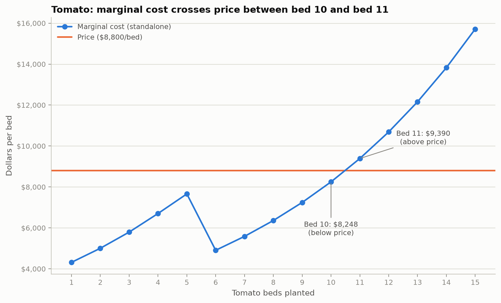
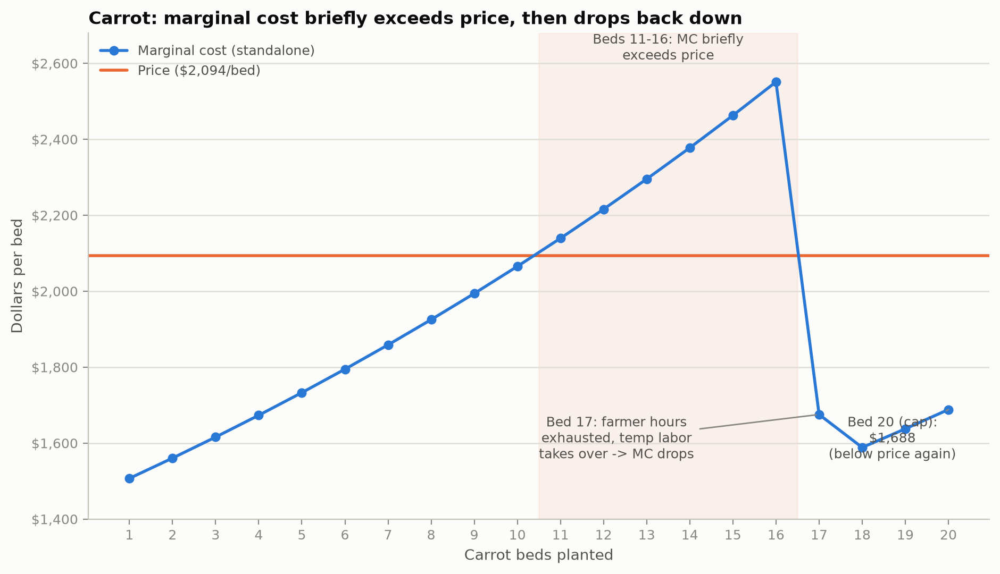
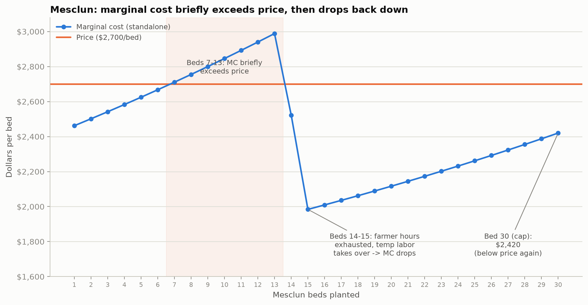

# Perfect Competition — Analysis

## 1. Why tomatoes stop at ~10 beds

Tomato beds earn $8,800 in revenue per bed. The marginal cost increases from $8,248.11 at bed 10 to approximately $9,390 at bed 11. At bed 10, the marginal cost is still below the $8,800 earned from the bed, meaning the 10th bed contributes about $551.89 in additional profit. However, at bed 11, the marginal cost is higher than the $8,800 in revenue it would generate. This means the 11th bed would cost more to produce than it would earn and would therefore reduce the farm's profit.

This explains why the model stops at approximately 10 tomato beds. In perfect competition, the farm continues to expand production while the price earned from another unit is greater than its marginal cost. Production stops around the point where P = MC. In this case, the $8,800 price falls between the marginal cost of beds 10 and 11 (Figure 1). Although diminishing returns contribute to increasing labor requirements, the decision to stop planting tomatoes is based on whether the revenue from the next bed is greater than the cost of producing it. Therefore, even though tomatoes have the highest revenue per bed, planting the maximum of 20 tomato beds would not be the most profitable decision.

## 2. Which constraints bind, and shadow prices

The model shows that both carrots and mesclun reach their maximum limits, with 20 carrot beds and 30 mesclun beds planted (Figures 2 and 3). This means both crop limits are binding constraints. To understand what these limits are costing the farm, I looked at what would happen if each crop was allowed one additional bed and the entire farm was re-optimized.

When the carrot limit is increased from 20 to 21 beds, the farm's profit increases by approximately $353.10. This means the carrot bed limit has a shadow price of about $353 per additional bed. When the mesclun limit is increased from 30 to 31 beds, the farm's profit increases by approximately $246.57, giving the mesclun bed limit a shadow price of about $247 per additional bed. These numbers show how much additional profit the farm could make by relaxing each crop limit by one bed while still considering the farm's shared labor and other resources.

Since the shadow price is higher for carrots, allowing one additional carrot bed would add more profit than allowing one additional mesclun bed under the current conditions. If the farm could expand only one of these crop limits, increasing the carrot limit would provide the larger financial benefit.

The farm also has constraints that are not binding. It uses only about 60 of the 64 available beds, leaving about four beds unused. The temporary-labor limit is also not fully used. The farm uses 4,558.86 of the 5,760 temporary labor hours available, or about 79% of its temporary labor capacity, leaving approximately 1,201 hours unused. Since the farm still has unused beds and temporary labor available, neither of these constraints is currently limiting the solution. Under the current conditions, simply increasing the total bed limit or the temporary-worker limit would not increase the farm's profit.

## 3. The tomato marginal-cost dip

When I looked at the marginal cost of tomatoes, I noticed a large drop around bed 6 (visible in Figure 1). The marginal cost drops from about $7,660 at bed 5 to $4,906 at bed 6. At first, this seemed strange because the amount of labor needed is still increasing due to diminishing returns. After looking more closely at the labor costs, I was able to see what was causing the drop.

The farm has 720 hours of the farmer's own labor, valued at $34.72 per hour. Around this point, those 720 hours are fully used and the farm begins relying more on temporary labor, which costs only $17.36 per hour. Even though the additional tomato beds require more labor, the new labor hours are much cheaper. For a short period, the lower cost of temporary labor is enough to outweigh the increasing amount of labor needed, causing the marginal cost to drop. As more tomato beds are added, diminishing returns eventually have a greater effect and the marginal cost begins to rise again.

This helped me understand that the marginal cost of another tomato bed depends on more than just how many labor hours are needed. It also depends on how much those labor hours cost. In this case, the switch from the farmer's more expensive labor to cheaper temporary labor explains why the marginal cost temporarily drops even though the amount of labor needed continues to increase.

## 4. Why grow crops that lose money alone

When I looked at each crop by itself, I found that carrots and mesclun lose money at every quantity. Even at their best results, carrots still lose about $16,480 and mesclun loses about $11,919. Their best standalone results also happen at their bed limits of 20 carrots and 30 mesclun, which connects back to the binding constraints I found earlier. Their marginal costs are still below their prices when they reach their bed limits. However, the marginal costs for both crops briefly rise above their prices earlier in the range before dropping back down when the farm begins using the cheaper temporary labor discussed in Section 3 — visible as the hump in Figures 2 and 3. Tomatoes are different because at 10 beds they can make a standalone profit of approximately $6,176. This means the question of why the farm would grow crops that lose money really applies to carrots and mesclun, not tomatoes.

At first, it might seem like the farm should not grow carrots or mesclun if they cannot make a profit on their own. However, the farm has $20,000 in fixed costs that have to be paid regardless of what is planted. When I look at carrots or mesclun by themselves, each crop has to take on that entire fixed cost, which makes it look unprofitable on its own. When deciding whether to keep producing, what matters is whether the crop earns enough to cover its variable costs and contribute something toward the fixed costs the farm already has to pay.

This connects to the shutdown rule in microeconomics. In the short run, production can still make sense as long as price is greater than or equal to average variable cost (P ≥ AVC), even if the business is showing an overall loss after fixed costs are included. In this case, carrots and mesclun still contribute toward the farm's fixed costs instead of leaving the farm to pay those costs without their contribution. This helped me understand why the model still chooses all 20 carrot beds and 30 mesclun beds, even though neither crop makes a profit when grown alone. A crop does not necessarily have to be profitable by itself to still be valuable to the farm's overall planting mix.

## Figures

**Figure 1.** Tomato marginal cost vs. price, beds 1–15. Shows the dip at bed 6 (Section 3) and the crossing between bed 10 and bed 11 (Section 1) that sets the stopping point.

**Figure 2.** Carrot marginal cost vs. price, beds 1–20. Marginal cost briefly exceeds price (beds 11–16) before dropping back below it once temporary labor takes over, ending below price again at the bed cap (Sections 2 and 4).

**Figure 3.** Mesclun marginal cost vs. price, beds 1–30. Same pattern as carrots: marginal cost exceeds price for a stretch (beds 7–13), then drops back below it, ending below price again at the bed cap (Sections 2 and 4).

## Against the hypothesis

In the Stage 1 hypothesis, I predicted that the best planting mix would be 30 mesclun beds, 20 carrot beds, and 12 tomato beds. The model matched my prediction for mesclun and carrots, but it found that 10 tomato beds, rather than the 12 I predicted, was the more profitable choice. My original prediction focused mostly on whether the farm had enough labor available to plant additional beds. I expected labor to be the main constraint, so I assumed the farm would continue planting tomatoes until it came closer to using all of its available labor.

The model showed me that having enough labor available does not necessarily mean planting another bed is worth it. At tomato bed 10, the marginal cost is $8,248.11, which is still below the $8,800 earned from that bed. By bed 11, however, marginal cost increases to about $9,390, which is more than the revenue the bed would generate. This means the farm should stop at about 10 tomato beds even though it still has labor and bed capacity available. My original hypothesis focused too much on how much the farm could physically produce, while the model showed that I also needed to consider whether producing the next bed would actually increase profit. This helped me understand why marginal cost, rather than the amount of available labor, determined where tomato production should stop.
